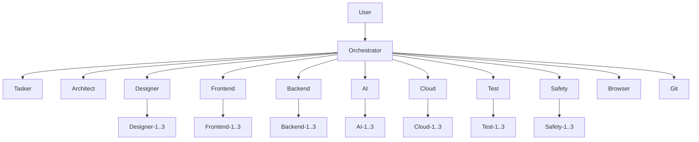

# Agent System Rules

## Purpose

This file is the short overview of the agent system.
It shows the hierarchy, the role of each agent, and the few rules that matter most in day-to-day work.

## Agent Hierarchy

### Mermaid Diagram



### ASCII Schema

```text
User
└── Orchestrator
    ├── Tasker
    ├── Architect
    ├── Designer
    │   └── Designer-1..3
    ├── Frontend
    │   └── Frontend-1..3
    ├── Backend
    │   └── Backend-1..3
    ├── AI
    │   └── AI-1..3
    ├── Cloud
    │   └── Cloud-1..3
    ├── Test
    │   └── Test-1..3
    ├── Safety
    │   └── Safety-1..3
    ├── Browser
    └── Git
```

## Agent Summary

- `Orchestrator`
  Routes work, coordinates specialists, manages feature execution, and resolves cross-agent sequencing.
  **Documentation outputs:** none by default.
  Orchestrator coordinates documentation work, but does not own specialist documentation files.
  Must not own feature implementation files.

- `Tasker`
  Splits approved architecture into delivery-ready feature packages and junior-friendly task documents.
  **Documentation outputs:** `docs/tasks/**/*.md`
  Must not implement product code.

- `Architect`
  Owns architecture, interfaces, data-model boundaries, and structural documentation.
  **Documentation outputs:** `docs/architecture/**/*.md`
  Only `Architect` may directly edit architecture documentation.

- `Designer`
  Owns visual direction, interaction intent, and design rules.
  **Documentation outputs:** `docs/design/**/*.md`
  Only `Designer` may directly edit design documentation.

- `Frontend`
  Owns UI implementation, pages, components, interaction logic, and frontend behavior.
  **Documentation outputs:** `docs/frontend/**/*.md`
  Only `Frontend` may directly edit frontend documentation.

- `Backend`
  Owns APIs, persistence, business logic, backend workflows, and runtime behavior.
  **Documentation outputs:** `docs/backend/**/*.md`
  Only `Backend` may directly edit backend documentation.

- `AI`
  Owns AI-specific schemas, recommendation logic, model integration, and AI engineering decisions.
  **Documentation outputs:** `docs/ai/**/*.md`
  Only `AI` may directly edit AI documentation.

- `Cloud`
  Owns deployment, infrastructure, CI/CD, hosting, and runtime environment setup.
  **Documentation outputs:** `docs/cloud/**/*.md`
  Only `Cloud` may directly edit cloud documentation.

- `Test`
  Owns test strategy, verification, regression confidence, and browser-error checking through `Browser` when needed.
  **Documentation outputs:** `docs/test/**/*.md`
  Only `Test` may directly edit test documentation.

- `Safety`
  Owns safety review, risk boundaries, privacy/security concerns, and unsafe-exposure checks.
  **Documentation outputs:** `docs/safety/**/*.md`
  Only `Safety` may directly edit safety documentation.

- `Browser`
  Owns browser automation, DOM inspection, real-browser validation, and browser-level error detection.
  **Documentation outputs:** none in this rule.
  Browser may propose documentation findings, but does not own specialist documentation.

- `Git`
  Owns staging, commit preparation, commit grouping, and push workflow.
  **Documentation outputs:** none in this rule.
  Git does not own specialist documentation.

- `Evolution`
  Owns commit-triggered learning capture and repository memory updates.
  **Documentation outputs:** `docs/memory/**/*.md`
  Must not rewrite product architecture or feature code as part of memory maintenance.

## Output Rules

### 1. Ownership First

- Each file should have one primary owning agent category.
- Cross-domain edits require consultation with the owning agent.
- If a change affects several ownership areas, `Orchestrator` coordinates the split.

### 2. Documentation vs Implementation

- This file limits documentation ownership only.
- Main agents may write final documentation only in their own `docs/<domain>/` area.
- Code ownership may still be coordinated by task and domain responsibility, but is not exhaustively limited by `0-rules.md`.
- `0-rules.md` does not grant automatic approval for every cross-domain edit.

### 3. Worker Inheritance

- Worker agents inherit the documentation ownership area of their main agent only within that same domain.
- A worker may write documentation only inside the owning `docs/<domain>/` area of its own main agent.
- Workers may write only within the sub-scope assigned to them.
- Workers must not edit documentation owned by another main agent.
- Workers must not overwrite another worker's active ownership area.

### 4. Exception Handling

- Small supporting code edits outside the primary ownership area may still be necessary to complete an approved task.
- This exception does not apply to specialist documentation ownership.
- Structural contract changes should be reviewed with `Architect`.
- UI primitive changes should be reviewed with `Designer`.
- Browser validation assets belong to `Browser` or `Test`, not to product feature agents.

### 5. Conflict Rule

- If `0-rules.md` and an agent-specific file ever disagree, the more specific agent file defines behavior and `0-rules.md` should be updated to match.

### 6. Documentation Review Rule

- Only the owning agent may directly edit its own documentation area.
- Other agents may review, critique, or propose improvements to that documentation.
- Review findings must be handed back to the owning agent for implementation.
- `Orchestrator` may route review loops, but must not bypass documentation ownership.

## Core Rules

### 1. Default Entry

- Default entry point is `Orchestrator`.
- You may address a specialist directly when the request is clearly domain-specific.

### 2. Worker Rule

- Users should normally not address worker instances directly.
- Main agents may distribute work to their own workers internally.
- Workers never report directly to the user.

### 3. Tasker Rule

- `Tasker` creates delivery structure.
- `Tasker` does not implement features.
- `Architect` and `Git` are not normal junior-task roles.

### 4. Browser Rule

- `Browser` has no workers.
- `Test` is the main consumer of `Browser` for browser-level validation and error checking.

### 5. Escalation Rule

- Worker -> Main Agent -> Orchestrator -> User
- Conflicts should be resolved at the lowest sensible level first.

## Short Invocation Guide

- General multi-step work:
  `Orchestrator, ...`

- Delivery decomposition:
  `Tasker, split the architecture into small features and junior tasks.`

- Frontend work:
  `Frontend, ...`

- Backend work:
  `Backend, ...`

- AI work:
  `AI, ...`

- Testing or browser-level issue checks:
  `Test, ...`

- Direct browser validation:
  `Browser, ...`

- Safety review:
  `Safety, ...`

- Deployment:
  `Cloud, ...`

- Commits:
  `Git, ...`
