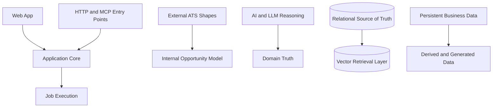

# System Boundaries

See also: [index.md](./index.md)

## Purpose

This document defines the mandatory cross-boundary constraints of the architecture.

Primary use:

- prevent incorrect layer crossing
- prevent truth-model leakage
- prevent transport, AI, retrieval, and provider semantics from contaminating the wrong layer

## Boundary Rule

Every important boundary in this architecture should make four things clear:

- what exists on each side of the boundary
- why the boundary exists
- what responsibility must not leak across it
- what risk appears when the boundary becomes unclear

Implementation rule:

- when code crosses one of these boundaries incorrectly, the code is architecturally wrong even if it appears to work

## Boundary Overview

Required interpretation:

- each arrow implies a handoff boundary, not permission to merge concerns
- downstream LLMs must preserve the separation intent of each boundary below

## `Web App` vs `Application Core`

### Boundary

The web app owns presentation, user interaction, and flow initiation.
The application core owns business orchestration, business decisions, and system workflows.

### Why this boundary exists

The user-facing interface must remain replaceable and lightweight compared to the business core.

### What must not leak across the boundary

- scraping logic
- matching logic
- retrieval orchestration
- provider-specific behavior
- business-state ownership

### Risk if unclear

The UI becomes a hidden business runtime and the backend loses authority over the product logic.

Implementation consequence:

- do not place recommendation truth, scraping, or retrieval orchestration in frontend code

## `HTTP` and `MCP` Entry Points vs Shared Capability Layer

### Boundary

HTTP and MCP are entry mechanisms.
They are not independent business systems.

### Why this boundary exists

The same product capabilities must remain reusable across web usage and agent-driven usage.

### What must not leak across the boundary

- duplicated business logic
- transport-specific branching inside core use cases
- separate truth models for HTTP and MCP

### Risk if unclear

The product develops two inconsistent backends that drift in behavior over time.

Implementation consequence:

- implement transport adapters separately only at the edge; keep business semantics shared

## `Request Cycle` vs `Job Execution`

### Boundary

Short-lived user-facing work belongs in the request cycle.
Long-running or wide-scope work belongs in job execution.

### Why this boundary exists

The system interacts with slow, unstable, or large-scale external scraping and enrichment flows that cannot be safely modeled as ordinary request-response behavior.

### What must not leak across the boundary

- unbounded work inside request handlers
- hidden long-running side effects
- in-memory-only progress tracking for durable jobs

### Risk if unclear

The product times out, progress becomes invisible, and operational failures become hard to recover from.

Implementation consequence:

- unbounded scraping and enrichment must be job-backed, progress-capable, and recoverable

## `External ATS Shapes` vs `Internal Opportunity Model`

### Boundary

External provider data is unstable and provider-specific.
The internal opportunity model is product-owned and stable.

### Why this boundary exists

The product needs one consistent job representation regardless of provider family.

### What must not leak across the boundary

- raw provider fields inside core business logic
- provider naming assumptions in product workflows
- partially normalized external state treated as internal truth

### Risk if unclear

Provider changes break unrelated business behavior and make the product model unstable.

Implementation consequence:

- normalize provider payloads before core business use

## `AI and LLM Reasoning` vs `Domain Truth`

### Boundary

AI-assisted reasoning may support product behavior, but the domain remains the owner of stable product truth.

### Why this boundary exists

LLM output is probabilistic, while the product requires stable business entities, statuses, and explicit lifecycle rules.

### What must not leak across the boundary

- treating generated text as authoritative product state without normalization
- letting an LLM redefine business lifecycle meaning
- replacing explicit business rules with implicit model output

### Risk if unclear

The system becomes difficult to reason about, hard to test, and vulnerable to inconsistent behavior.

Implementation consequence:

- generated output may inform decisions but must not silently redefine domain state

## `Relational Source of Truth` vs `Vector Retrieval Layer`

### Boundary

Relational storage owns operational product truth.
Vector retrieval augments relevance-based lookup.

### Why this boundary exists

Retrieval improves ranking and semantic recall, but it is not a reliable replacement for transactional product state.

### What must not leak across the boundary

- treating retrieval output as canonical record ownership
- storing operational lifecycle meaning only in embedding-based access paths
- replacing identity and integrity rules with semantic similarity

### Risk if unclear

The product loses data integrity and retrieval becomes falsely authoritative.

Implementation consequence:

- retrieval output is supporting context; relational state remains authoritative

## `Persistent Business Data` vs `Derived and Generated Data`

### Boundary

Persistent business data records what the product must reliably know.
Derived and generated data records what the system inferred, scored, summarized, or suggested.

### Why this boundary exists

The product must distinguish between facts, decisions, and generated assistance.

### What must not leak across the boundary

- treating generated recommendations as primary business records
- storing temporary derived output as if it were permanent truth
- confusing user action history with model-generated interpretation

### Risk if unclear

Users and developers lose clarity about what is factual, what is inferred, and what may be regenerated.

Implementation consequence:

- persist derived data with derived semantics; do not overwrite business truth with generated interpretation

## Boundary Evolution Rule

When the architecture introduces a new runtime path, integration, agent interaction, data flow, or persistence pattern, the architecture must explicitly check whether:

- a new system boundary has been created
- an existing boundary has become more important
- a previously sufficient boundary has become too weak or blurred

If so, the architecture documentation should be updated accordingly.
