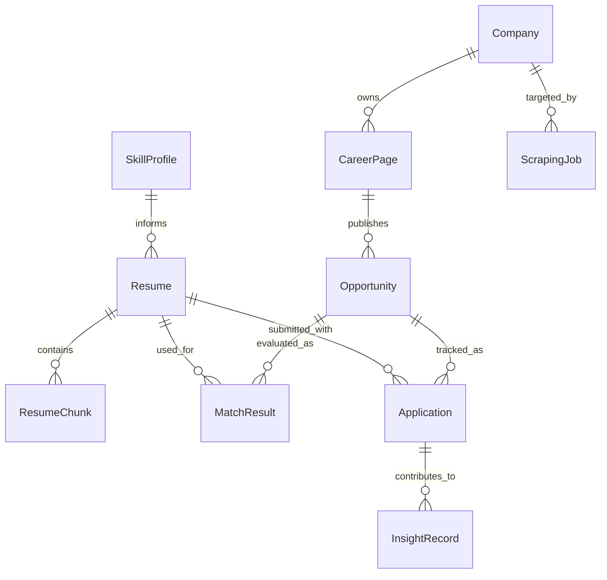

# Data Model

See also: [index.md](./index.md)

## Purpose

This document defines the core architecture-level data model for CeeVee.

## Data Stores

The approved storage model is:

- Supabase Postgres for primary relational data
- `pgvector` in the same database for embeddings
- object storage for uploaded resume files

## Core Entities

- `Resume`
  Represents a user-managed resume version and its source file metadata.

- `ResumeChunk`
  Represents a semantically meaningful chunk extracted from a resume for retrieval use cases.

- `SkillProfile`
  Represents explicit user-listed skills and derived skill evidence from resume content.

- `Company`
  Represents a discovered company candidate with source metadata.

- `CareerPage`
  Represents a known career page URL and ATS detection metadata.

- `Opportunity`
  Represents a normalized job listing.

- `MatchResult`
  Represents a score, explanation, and resume recommendation for an opportunity-resume pair.

- `Application`
  Represents an application event with status such as applied, interview, rejection, or no response.

- `InsightRecord`
  Represents generated patterns, recommendations, or learning signals derived from prior applications.

- `ScrapingJob`
  Represents a persisted long-running scraping or enrichment task with status and progress metadata.

## Entity Relationship Diagram

Purpose:
This diagram shows the major persistent entities and their relationships.

What the reader should understand:
The architecture centers on resumes, opportunities, and application history, with retrieval-related entities supporting those core flows.

Why the diagram belongs here:
Entity structure and relationships are data-model concerns.

## Data Lifecycle Notes

### Resume

- uploaded once
- versioned over time
- chunked for retrieval
- referenced by matching and cover-letter features

Initial retrieval guidance:

- use semantically coherent chunks rather than fixed line splits where possible
- start with bounded chunk sizes and overlap as configurable defaults
- keep chunking strategy replaceable behind the retrieval pipeline

### Opportunity

- discovered through scraping
- normalized into a stable internal shape
- rescored when relevant resume or retrieval context changes

### ScrapingJob

- created when a scraping request exceeds bounded synchronous work
- tracks status, timing, and partial progress
- supports resumable processing and user-visible progress retrieval

### Application

- created when the user marks an opportunity as applied
- updated as outcomes change
- contributes to future insights and similarity retrieval

## Vector Search Responsibilities

Vector retrieval is used for:

- application history similarity
- resume-chunk retrieval

The vector layer must not replace the relational source of truth. It supplements ranked retrieval only.

Initial retrieval controls should remain configurable at runtime or deployment level, including:

- chunk-size defaults
- chunk-overlap defaults
- retrieval top-k
- score thresholds

## Data Risks

- duplicate opportunities across repeated scraping
- stale career-page snapshots
- weak chunking quality reducing retrieval quality
- uncontrolled growth of generated insight records
- unbounded scraping jobs without progress visibility

The implementation should therefore include identity, freshness, and retention rules even if the first MVP keeps them simple.
