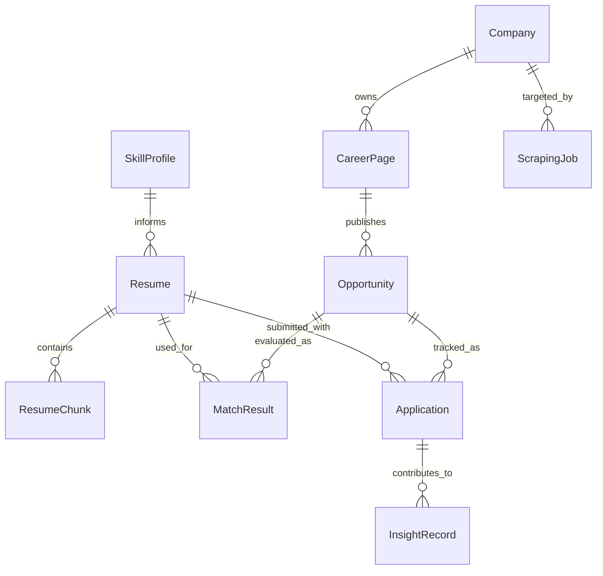

# Data Model

See also: [index.md](./index.md)

## Purpose

This document defines entity meaning, entity relationships, lifecycle semantics, and truth-model rules.

## Scope

This file owns:

- entity definitions
- relationship meaning
- lifecycle meaning
- truth-model distinctions between business data and derived data

This file does not own:

- transport contracts
- module placement
- runtime trigger scheduling

## Data Stores

The approved storage model is:

- Supabase Postgres for primary relational data
- `pgvector` in the same database for embeddings
- object storage for uploaded resume files

## Core Entities

- `Resume`
  Represents a user-managed resume version and its source file metadata.

- `ResumeChunk`
  Represents a semantically meaningful chunk extracted from a resume for retrieval use cases.

- `SkillProfile`
  Represents explicit user-listed skills and derived skill evidence from resume content.

- `Company`
  Represents a discovered company candidate with source metadata.

- `CareerPage`
  Represents a known career page URL and ATS detection metadata.

- `Opportunity`
  Represents a normalized job listing.

- `MatchResult`
  Represents a score, explanation, and resume recommendation for an opportunity-resume pair.

- `Application`
  Represents an application event with status such as applied, interview, rejection, or no response.

- `InsightRecord`
  Represents generated patterns, recommendations, or learning signals derived from prior applications.

- `ScrapingJob`
  Represents a persisted long-running scraping or enrichment task with status and progress metadata.

Entity rule:

- do not invent new top-level entities that overlap with existing entity meaning without updating this file

## Entity Relationship Diagram

Required interpretation:

- `Resume` and `Opportunity` are independent catalogs
- `MatchResult` and `Application` are different relationship types with different meanings
- derived entities must not be interpreted as primary business truth automatically

## How `Resume` And `Opportunity` Relate

`Resume` and `Opportunity` are not modeled as one directly coupled pair.
Architecturally, they are two independent business catalogs:

- resumes represent the user-side application material
- opportunities represent the normalized market-side job targets

They intersect in two different ways:

### `MatchResult` as the analysis relationship

`MatchResult` connects a resume and an opportunity when the system evaluates fit.

This relationship exists for analysis and recommendation purposes.
It expresses:

- match score
- reasoning summary
- recommendation or fit guidance

A single resume may be evaluated against many opportunities.
A single opportunity may also be evaluated against multiple resume versions.

### `Application` as the action relationship

`Application` connects a resume and an opportunity when the user takes an actual application step.

This relationship exists for business history and user action tracking.
It expresses:

- which resume version was actually used
- which opportunity the user acted on
- which lifecycle state followed

### Why both relationships matter

The architecture intentionally separates:

- analysis
  “How well could this resume fit this opportunity?”

- action
  “Which resume was actually used when the user applied?”

This distinction is important because the learning system should not treat theoretical matching and real application history as the same kind of truth.

### Why this matters for insights

The insight system learns from the crossings between resumes, opportunities, and outcomes over time.

That means:

- `MatchResult` helps explain potential fit
- `Application` records actual user action and outcome
- insight generation can compare predicted fit with real-world application results

Architecturally, CeeVee is centered around these intersections so the system can improve over time without collapsing analysis, action, and historical truth into one entity.

Implementation rule:

- do not merge `MatchResult` and `Application`
- do not store real application history only inside match outputs

## Data Lifecycle Notes

### Resume

- uploaded once
- versioned over time
- chunked for retrieval
- referenced by matching and cover-letter features

Initial retrieval guidance:

- use semantically coherent chunks rather than fixed line splits where possible
- start with bounded chunk sizes and overlap as configurable defaults
- keep chunking strategy replaceable behind the retrieval pipeline

### Opportunity

- discovered through scraping
- normalized into a stable internal shape
- rescored when relevant resume or retrieval context changes

### ScrapingJob

- created when a scraping request exceeds bounded synchronous work
- tracks status, timing, and partial progress
- supports resumable processing and user-visible progress retrieval

### Application

- created when the user marks an opportunity as applied
- updated as outcomes change
- contributes to future insights and similarity retrieval

`Application` is also the primary historical learning source for the insight system because outcome changes provide the strongest real-world feedback signal in the product.

Implementation consequence:

- if an outcome change is missing from `Application`, the learning system has lost its strongest signal

## Vector Search Responsibilities

Vector retrieval is used for:

- application history similarity
- resume-chunk retrieval

The vector layer must not replace the relational source of truth. It supplements ranked retrieval only.

Initial retrieval controls should remain configurable at runtime or deployment level, including:

- chunk-size defaults
- chunk-overlap defaults
- retrieval top-k
- score thresholds

## Data Risks

- duplicate opportunities across repeated scraping
- stale career-page snapshots
- weak chunking quality reducing retrieval quality
- uncontrolled growth of generated insight records
- unbounded scraping jobs without progress visibility

The implementation should therefore include identity, freshness, and retention rules even if the first MVP keeps them simple.
