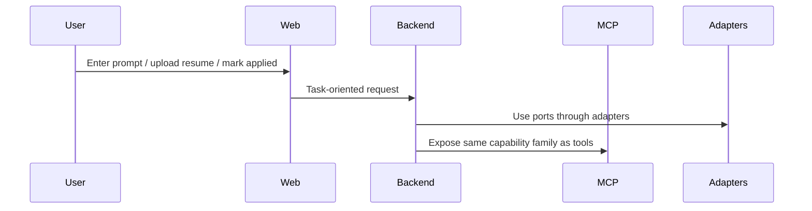

# Interfaces

See also: [index.md](./index.md)

## Purpose

This document defines entry-point semantics and interface rules for downstream implementation.

## Scope

This file owns:

- web-to-backend entry semantics
- MCP-to-backend entry semantics
- shared capability-layer rules
- interface-level failure classes

This file does not own:

- internal module placement
- entity lifecycle semantics
- adapter implementation details

## Interface Categories

- Web-to-backend application interface
- MCP tool interface
- Port interfaces inside the domain
- External provider interfaces

## Web-To-Backend Interface

The web app communicates only with the backend service. The backend is the authoritative owner of:

- resume ingestion
- company discovery
- scraping orchestration
- opportunity ranking
- application tracking
- insights retrieval
- cover-letter scaffolding generation

The frontend contract should prefer task-oriented endpoints over low-level provider-shaped APIs.
Every backend-facing request must execute within an explicit user context, even in the single-user MVP.

Implementation rules:

- expose task-oriented endpoints, not provider-shaped passthrough endpoints
- do not expose raw ATS or provider payloads as the primary frontend contract
- do not let frontend-specific concerns redefine backend capability semantics

## MCP Tool Interface

The backend exposes a stable MCP tool surface for agent-driven usage.
The MCP runtime is an integrated part of `apps/api`, not a separate business-logic stack.

Initial tools:

- `discover_companies(prompt)`
  Returns a candidate company list for a natural-language search prompt.

- `scrape_career_page(url)`
  Returns normalized job listings for a single career page.

- `match_resume(job_id, resume_id)`
  Returns a score, explanation, and recommendation for a job-resume pair.

- `log_application(job_id, resume_id)`
  Stores an application event and its current state.

- `get_application_insights()`
  Returns retrieval-backed patterns from prior applications.

Implementation rules:

- MCP tool names are part of a stable capability surface
- MCP handlers must call the same capability layer as HTTP handlers
- do not implement MCP-only business logic that diverges from HTTP behavior unless architecture docs explicitly authorize it

## Interface Flow

Required interpretation:

- Web and MCP are transport variants over one capability layer
- transport-specific validation is allowed
- transport-specific business semantics are not allowed unless explicitly documented

## Port Contract Expectations

The architecture-level definitions of the external-facing ports are maintained in [port-contracts.md](./port-contracts.md).

Transport-facing validation schemas should be defined once in shared contract definitions and reused across:

- HTTP request validation
- MCP tool input validation
- frontend form validation where appropriate

This keeps Web and MCP interfaces aligned while preserving domain isolation.

Implementation rule:

- if a field or contract belongs to HTTP and MCP, define it once in shared transport contracts
- do not duplicate incompatible request shapes for the same capability without explicit architecture approval

## Failure Behavior

Architecture-level interface behavior must distinguish between:

- user-visible validation errors
- temporary provider failures
- scraping extraction failures
- retrieval degradation
- missing resume or opportunity references

The backend should return stable, categorized failures rather than leaking provider-specific errors directly.

For long-running scraping or enrichment operations, the interface layer should prefer:

- accepted-job responses
- progress polling or status retrieval
- stable completion and failure states

Do not infer:

- that every backend capability is synchronous
- that a frontend request must wait for full scraping completion
- that provider-specific error payloads are acceptable public contracts

## Evolution Expectations

- MCP tool names should remain stable once published
- web endpoints may evolve faster, but should remain task-oriented
- port interfaces may change only with explicit coordination across affected modules
- user-context handling should remain compatible when the project moves from single-user mode to Supabase Auth
