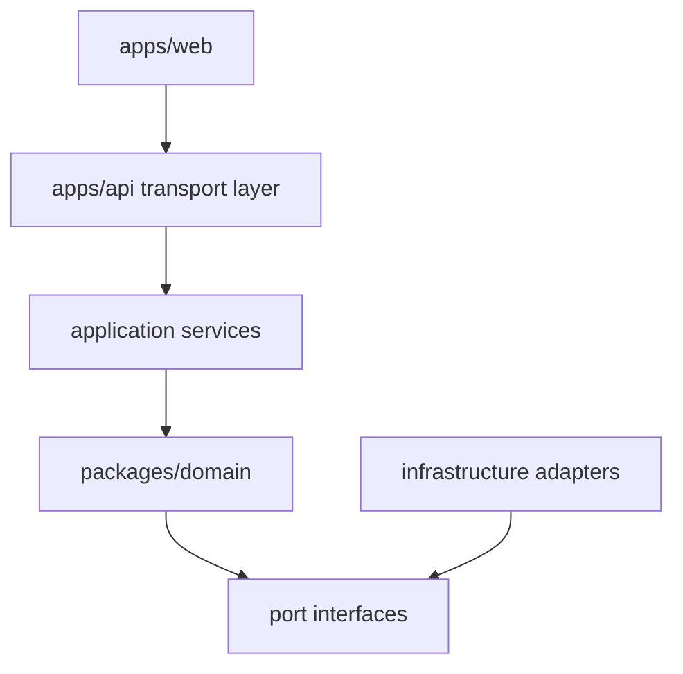

# Module Design

See also: [index.md](./index.md)

## Purpose

This document defines the internal module structure and ownership boundaries of the CeeVee architecture.

## Monorepo Shape

The approved repository shape is:

- `apps/web`
  Next.js App Router frontend

- `apps/api`
  Node.js backend service exposing HTTP and MCP-facing capabilities

- `packages/domain`
  Pure business entities, use cases, and port definitions

- `packages/shared`
  Shared transport DTOs, validation schemas, and stable cross-runtime types

## Internal Architectural Layers

Purpose:
This diagram shows the internal layering from the web interface to the domain core and infrastructure adapters.

What the reader should understand:
The domain defines required capabilities through ports, and adapters satisfy those ports without leaking infrastructure concerns into the core.

Why the diagram belongs here:
Layering and module ownership are module-design concerns.

## Core Domain Areas

The backend domain is split into these major areas:

- `resume`
  Resume upload metadata, version lifecycle, resume chunks, and skill inventory references

- `company-discovery`
  Natural-language search interpretation and candidate company generation

- `scraping`
  Career page fetching, ATS detection, extraction, and job normalization

- `opportunities`
  Normalized job opportunities and ranking state

- `matching`
  Resume-to-job scoring, reasoning, and recommendation generation

- `applications`
  Applied state, outcomes, and history retrieval inputs

- `insights`
  Learning system, pattern detection, and skill-gap backlog generation

- `cover-letter`
  Scaffolding generation based on company and job context plus relevant resume chunks

## Port Definitions

The domain owns ports such as:

- `CompanyDiscoveryPort`
- `CareerPageScraperPort`
- `AtsDetectorPort`
- `JobNormalizationPort`
- `MatchEnginePort`
- `ResumeRepositoryPort`
- `OpportunityRepositoryPort`
- `ApplicationRepositoryPort`
- `EmbeddingPort`
- `RetrievalPort`
- `CoverLetterPort`
- `UserContextPort`

Each port must define purpose, input shape, output shape, and failure behavior.
The approved architecture-level definitions for the external-facing ports are documented in [port-contracts.md](./port-contracts.md).

## Adapter Categories

The backend owns these adapter categories:

- `llm`
  For discovery, reasoning support, and content scaffolding

- `supabase`
  For relational persistence and vector search

- `ats`
  Provider-specific scraping adapters for Greenhouse, Lever, Workday, and Ashby

- `mcp`
  For exposing backend capabilities as MCP tools

- `storage`
  For resume file handling and document access

- `jobs`
  For asynchronous scraping, enrichment, and reprocessing flows

- `auth-context`
  For resolving the backend user context used by HTTP and MCP entry points

## Backend Application Services

Application services orchestrate domain use cases and ports. They are responsible for:

- transaction boundaries where needed
- sequencing of discovery, scraping, scoring, and persistence
- choosing sync versus async execution paths
- exposing progress state for long-running jobs
- preparing MCP-facing results

They are not responsible for:

- UI rendering
- direct SQL inside core use cases
- provider-specific prompt or scraper details

## Shared Contract Rule

`packages/domain` owns business meaning and port contracts.

`packages/shared` owns transport-facing schemas and validation rules shared across:

- frontend forms
- backend HTTP handlers
- MCP tool handlers

The architecture must keep domain models and transport validation schemas related but not interchangeable.

## Scraping Robustness Rule

ATS adapters must support failure-aware behavior rather than assuming ideal provider access.

The architecture should support:

- categorized extraction failures
- retry with bounded backoff
- development-mode mock adapters
- resumable scraping jobs where repeated broad scraping is expected

## Frontend Boundary

The frontend may:

- render user workflows
- submit commands to the backend
- present ranked results and explanations
- collect user feedback and application outcomes

The frontend must not:

- implement business matching logic
- scrape external sites directly
- own retrieval logic
- construct provider-specific integration behavior

## Future Split Readiness

The architecture intentionally keeps the following future split points clean:

- async worker runtime for large scraping jobs
- dedicated retrieval worker or evaluation pipeline
- separate MCP transport process if external clients grow

These are not separate services in the MVP, but the boundaries are documented early to reduce future migration cost.
