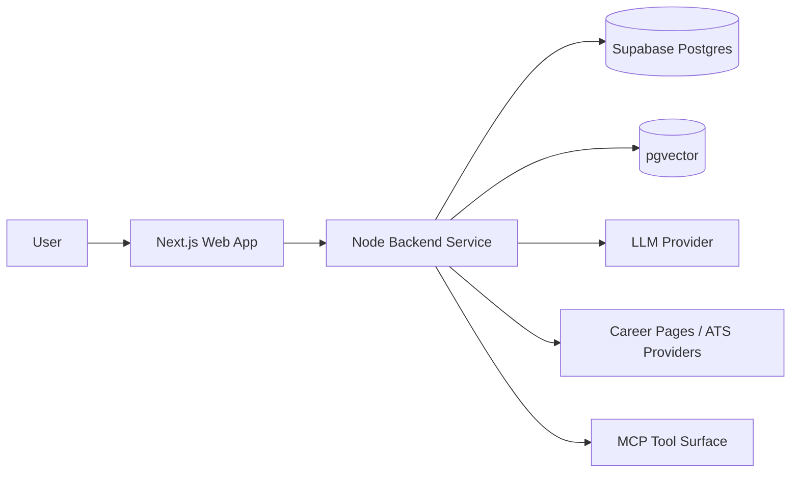

# CeeVee Architecture Overview

See also: [index.md](./index.md)

## Purpose

This document defines the global architecture decisions that all implementation work must follow.

## Scope

This file owns:

- runtime-shape decisions
- architecture invariants
- MVP architectural scope
- non-goals and deliberate deferrals

This file does not own:

- detailed module placement
- entry-point contracts
- entity lifecycle details
- runtime trigger details

## Approved Runtime Shape

CeeVee is a TypeScript monorepo with a separated frontend runtime and backend runtime.

Required runtime split:

- `apps/web` hosts the Next.js App Router frontend
- `apps/api` hosts the Node.js backend service
- `packages/domain` hosts pure domain models, use cases, and ports
- `packages/shared` hosts shared transport contracts and validation schemas

The architecture follows a hexagonal pattern. Core business logic depends only on ports. External systems such as Supabase, LLM providers, ATS career pages, and MCP transport are isolated behind adapters.

## Global Invariants

Implementation LLMs must preserve all of the following:

1. Domain purity
   Domain logic must not import HTTP frameworks, database drivers, scraper libraries, or LLM SDKs directly.

2. Adapter-first external access
   Discovery, scraping, retrieval, matching, storage, and generation must be accessed through ports and adapters.

3. Shared capability layer
   HTTP and MCP must call the same backend capability layer instead of duplicating business logic.

4. Explicit user context
   Backend-facing work must execute inside an explicit user-context boundary, even in single-user mode.

5. Bounded execution
   Unbounded discovery, scraping, and enrichment must not be modeled as ordinary request-cycle work.

6. Retrieval is additive
   Retrieval augments ranking and reasoning. It does not replace operational truth.

## MVP Scope In Architecture Terms

The architecture must support all of the following in MVP form:

- a single-user runtime model with an explicit backend user context boundary
- multiple resume versions
- natural-language company discovery
- ATS-aware career-page scraping
- normalized opportunity records
- job-to-resume match scoring
- application tracking and outcomes
- resume skill backlog generation
- cover-letter scaffolding support
- learning from prior applications via retrieval

The architecture must also preserve forward-compatible space for:

- later Supabase Auth integration without breaking domain contracts
- job progress reporting for long-running scraping work
- configurable retrieval parameters

## Required Interpretation For Downstream LLMs

- “single-user MVP” does not mean “no identity boundary”
- “separate backend service” does not mean “microservices”
- “retrieval” does not mean “replace relational truth”
- “matching” does not mean “text comparison only”
- “MCP support” does not authorize a separate business-logic stack

## Primary Runtime Topology

Required interpretation:

- `apps/web` is the user-facing runtime only
- `apps/api` owns integration-heavy and orchestration-heavy work
- external dependencies terminate at the backend runtime, not at the frontend runtime

## Deliberate Tradeoffs

Chosen:

- separate backend service
- one deployable backend runtime for MVP scope
- explicit async capability without full service decomposition

Not chosen yet:

- frontend-only API orchestration
- microservice decomposition
- multi-user tenant isolation
- auto-apply automation

## Scaling Direction

Preferred next-stage scaling path:

1. keep the monorepo structure stable
2. keep the domain and ports reusable
3. split long-running jobs into dedicated workers only when runtime pressure justifies it
4. preserve MCP compatibility at the backend boundary

Downstream LLMs must not introduce architectural changes that contradict this scaling direction without updating the owning architecture files first.
