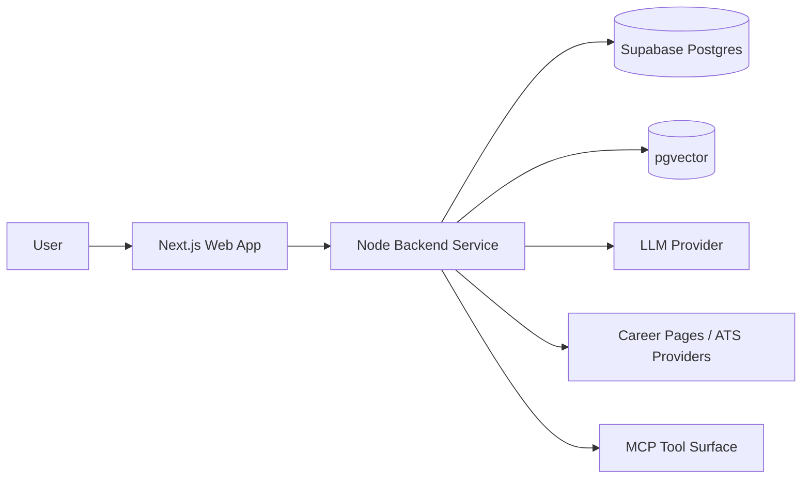

# CeeVee Architecture Overview

See also: [index.md](./index.md)

## Purpose

This document defines the approved architecture direction for the CeeVee MVP and its immediate scaling path.

## Architectural Summary

CeeVee is implemented as a TypeScript monorepo with a separated frontend and backend runtime:

- `apps/web` hosts the Next.js App Router frontend
- `apps/api` hosts a separate Node.js backend service
- `packages/shared` hosts shared types and cross-runtime contracts
- `packages/domain` hosts pure domain models, use cases, and port definitions

The architecture follows a hexagonal pattern. Core business logic depends only on ports. External systems such as Supabase, LLM providers, ATS career pages, and MCP transport are isolated behind adapters.

## Chosen Runtime Shape

### Approved direction

The project uses a separate backend service instead of Next.js API routes as the primary backend runtime.

### Why this direction fits this project

This project combines:

- frontend user flows
- MCP tool exposure
- external scraping
- AI-assisted matching
- retrieval and embeddings
- hybrid synchronous and asynchronous processing

These concerns are operationally easier to maintain in a dedicated backend runtime than inside frontend-coupled API routes.

### Best-practice baseline

For systems combining orchestration, ingestion, retrieval, and external integrations, a clear split between UI runtime and backend runtime is the preferred baseline.

### Adaptation for this project

The project is still MVP-focused, so the backend remains a single service rather than a microservice fleet. This preserves clarity without introducing premature deployment complexity.

## Architectural Principles

### 1. Hexagonal boundaries

Domain logic must not import database drivers, HTTP frameworks, scraper libraries, or LLM SDKs directly.

### 2. Monorepo with explicit ownership

Frontend, backend, and shared domain contracts live in one repository, but each area has clear ownership and runtime boundaries.

### 3. Adapter-first integrations

Career-page scraping, company discovery, resume parsing, matching, and RAG retrieval are modeled behind explicit ports so providers can change later.

### 4. Hybrid execution

Short-lived discovery and matching flows may run synchronously. Larger scraping and enrichment workflows must run asynchronously through a job model.

### 5. Retrieval as product infrastructure

Embeddings and semantic retrieval are part of the product architecture, not an optional later add-on.

### 6. Stable user context at the backend boundary

Even in the single-user MVP, backend-facing and MCP-facing flows must execute inside an explicit user context boundary.

This user context may initially resolve to a local single-user identity, but the architecture must not assume anonymous global access as the long-term contract.

### 7. Operationally bounded scraping

Discovery and scraping flows must be architected around bounded work units, progress visibility, and resumable execution rather than assuming that broad external scraping can finish inside a single request cycle.

## MVP Scope In Architecture Terms

The MVP architecture must support:

- a single-user runtime model with an explicit backend user context boundary
- multiple resume versions
- natural-language company discovery
- ATS-aware career-page scraping
- normalized opportunity records
- job-to-resume match scoring
- application tracking and outcomes
- resume skill backlog generation
- cover-letter scaffolding support
- learning from prior applications via retrieval

The MVP must also preserve forward-compatible architectural space for:

- later Supabase Auth integration without breaking domain contracts
- job progress reporting for long-running scraping work
- configurable retrieval parameters

## Primary Runtime Topology

Purpose:
This diagram shows the top-level runtime split and the primary external dependencies.

What the reader should understand:
The frontend is separated from the backend runtime, and the backend owns all integration-heavy behavior.

Why the diagram belongs here:
This file defines the overall architectural direction and runtime shape.

## Main Tradeoffs

### Chosen

- Separate backend service
- One deployable backend runtime for the MVP
- Explicit async capability without requiring a large event-driven platform

### Deliberately not chosen yet

- frontend-only API orchestration
- microservice decomposition
- multi-user tenant isolation
- auto-apply automation

## Scaling Path

The immediate next-stage scaling path is:

1. keep the monorepo structure stable
2. keep the domain and ports reusable
3. split long-running jobs into dedicated workers only when runtime pressure justifies it
4. preserve MCP compatibility at the backend boundary

The architecture is therefore optimized for MVP delivery with a low-friction path to stronger operational separation later.
