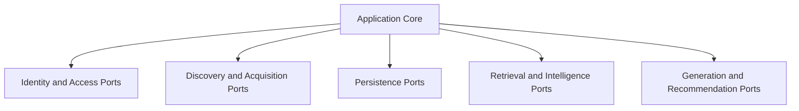

# Port Contracts

See also: [index.md](./index.md)

## Purpose

This document defines the architectural port contracts of CeeVee.

In this architecture, a port is not an implementation detail. A port is a boundary contract between the domain-centered application core and a class of external dependencies.

This document defines only the architectural meaning of those ports:

- why the port exists
- which boundary it protects
- which business responsibility it carries
- how stable the contract must remain over time

Concrete TypeScript interfaces, DTOs, schemas, adapters, and error-mapping details belong to backend implementation documentation rather than to this architecture document.

## Architectural Role Of Ports

Ports exist to preserve hexagonal boundaries.

They ensure that:

- the domain does not depend directly on providers or frameworks
- infrastructure can change without redefining core business behavior
- transport concerns do not leak into domain decisions
- application services orchestrate business capabilities through stable contracts

## Contract Principles

Every architectural port contract should define:

- business purpose
- protected boundary
- owning responsibility
- high-level input and output expectation
- high-level failure classes
- evolution rule

At this architecture level, ports describe capability boundaries, not method signatures.

## Port Categories

The external-facing architectural ports of CeeVee fall into these categories:

- identity and access boundary
- discovery and acquisition boundary
- persistence boundary
- retrieval and intelligence boundary
- generation and recommendation boundary

## Port Landscape

Purpose:
This diagram groups the architectural ports by the kind of external boundary they protect.

What the reader should understand:
Ports are organized by business responsibility and boundary type, not by technical adapter classes.

Why the diagram belongs here:
This file defines the architectural meaning of the port landscape.

## Identity And Access Boundary

### `UserContextPort`

#### Business purpose

Provides the identity context within which backend-facing work is executed.

#### Protected boundary

Protects the domain from direct dependence on transport-specific auth handling, session mechanics, or future provider-specific identity logic.

#### Owning responsibility

Owns the architectural boundary between business execution and caller identity resolution.

#### High-level input and output expectation

The core expects a stable user context suitable for scoping work, regardless of whether the current runtime is single-user or later becomes authenticated multi-user.

#### Failure classes

- unresolved identity context
- invalid identity state
- incompatible identity mode

#### Evolution rule

This port must remain stable when the project evolves from a single-user MVP to explicit authentication and authorization.

## Discovery And Acquisition Boundary

### `CompanyDiscoveryPort`

#### Business purpose

Transforms a user search intent into a set of candidate companies worth evaluating.

#### Protected boundary

Protects the domain from direct dependence on LLM-driven discovery logic or future alternative discovery providers.

#### Owning responsibility

Owns the business boundary between search intent interpretation and provider-specific discovery execution.

#### High-level input and output expectation

The core expects search intent in business terms and receives candidate companies in a stable internal business shape.

#### Failure classes

- invalid search intent
- provider failure
- no meaningful discovery result

#### Evolution rule

The contract must remain stable if discovery shifts from LLM-first to other provider or rules-based strategies.

### `CareerPageScraperPort`

#### Business purpose

Acquires job-listing information from external career pages.

#### Protected boundary

Protects the domain from direct dependence on network access, external page structure, scraping runtime constraints, and provider instability.

#### Owning responsibility

Owns the business boundary between “this page should be examined” and “job information has been acquired or failed”.

#### High-level input and output expectation

The core expects externally hosted career targets to be processed and turned into business-relevant extraction results.

#### Failure classes

- acquisition failure
- timeout or bounded-work interruption
- blocked access
- incomplete extraction

#### Evolution rule

The contract must stay compatible across synchronous bounded work and asynchronous job-based acquisition flows.

### `AtsDetectorPort`

#### Business purpose

Determines which provider family or page pattern governs a target career page.

#### Protected boundary

Protects the core from direct dependence on provider fingerprinting logic.

#### Owning responsibility

Owns the classification boundary between a target page and the acquisition strategy most likely to succeed.

#### High-level input and output expectation

The core expects a stable provider classification or an explicit unknown result.

#### Failure classes

- ambiguous classification
- unsupported provider family
- classification failure

#### Evolution rule

The contract must allow additional ATS families without changing consuming business use cases.

### `JobNormalizationPort`

#### Business purpose

Converts externally acquired job data into the internal opportunity representation used by the product.

#### Protected boundary

Protects the core from provider-specific payload structures and inconsistent external naming schemes.

#### Owning responsibility

Owns the business boundary between externally shaped listings and internally stable opportunity data.

#### High-level input and output expectation

The core expects opportunity information in the internal business shape, independent of where it came from.

#### Failure classes

- invalid source shape
- partial normalization
- unsupported source semantics

#### Evolution rule

The internal opportunity model must remain more stable than any single provider’s data shape.

## Persistence Boundary

### `ResumeRepositoryPort`

#### Business purpose

Provides the domain with access to resume versions and related resume-derived assets.

#### Protected boundary

Protects the core from direct dependence on storage layout, database shape, and file-handling mechanics.

#### Owning responsibility

Owns the persistence boundary for resume-related state.

#### High-level input and output expectation

The core expects stable business access to resumes, versions, and retrieval-relevant resume material.

#### Failure classes

- missing record
- persistence failure
- invalid ownership scope

#### Evolution rule

The contract must stay stable even if resume persistence changes across storage backends or metadata layouts.

### `OpportunityRepositoryPort`

#### Business purpose

Provides the domain with access to companies, career pages, opportunities, and related freshness state.

#### Protected boundary

Protects the core from direct dependence on relational schemas, deduplication mechanics, and storage-specific freshness handling.

#### Owning responsibility

Owns the persistence boundary for discovered and normalized opportunity state.

#### High-level input and output expectation

The core expects stable access to opportunity-oriented business records and their lifecycle state.

#### Failure classes

- missing record
- identity conflict
- persistence failure

#### Evolution rule

The contract must stay stable as opportunity freshness, deduplication, and lifecycle rules become more sophisticated.

### `ApplicationRepositoryPort`

#### Business purpose

Provides the domain with access to application history and outcome tracking.

#### Protected boundary

Protects the core from direct dependence on persistence details and reporting-oriented data storage concerns.

#### Owning responsibility

Owns the persistence boundary for application lifecycle state.

#### High-level input and output expectation

The core expects stable access to application events, outcomes, and historically relevant records.

#### Failure classes

- missing reference
- invalid lifecycle transition
- persistence failure

#### Evolution rule

The contract must remain stable as the learning and insight features place richer demands on application history.

## Retrieval And Intelligence Boundary

### `EmbeddingPort`

#### Business purpose

Turns business-relevant text material into embedding representations used by retrieval workflows.

#### Protected boundary

Protects the core from direct dependence on embedding providers, model choices, and provider-specific operational limits.

#### Owning responsibility

Owns the boundary between business text preparation and embedding generation.

#### High-level input and output expectation

The core expects text-derived representations usable by retrieval workflows without coupling to a specific provider.

#### Failure classes

- provider failure
- unsupported input volume or format
- timeout

#### Evolution rule

The contract must remain stable across provider and model changes.

### `RetrievalPort`

#### Business purpose

Returns semantically relevant material for matching, insights, and cover-letter support.

#### Protected boundary

Protects the core from direct dependence on vector-store behavior, ranking mechanics, and retrieval engine choices.

#### Owning responsibility

Owns the business boundary between semantic information needs and retrieval execution.

#### High-level input and output expectation

The core expects relevant business context returned in a stable ranked form, regardless of the underlying retrieval strategy.

#### Failure classes

- empty relevant result
- retrieval-system failure
- invalid retrieval scope

#### Evolution rule

The contract must support changing retrieval parameters, ranking strategies, and future reranking without changing business callers.

## Generation And Recommendation Boundary

### `MatchEnginePort`

#### Business purpose

Evaluates how well a resume version fits an opportunity and returns a business-level fit assessment.

#### Protected boundary

Protects the core from direct dependence on scoring heuristics, LLM reasoning flows, and composite evaluation pipelines.

#### Owning responsibility

Owns the business boundary between evaluation intent and concrete matching strategy.

#### High-level input and output expectation

The core expects a stable fit assessment, explanation, and recommendation result in business terms.

#### Failure classes

- missing business context
- evaluation failure
- degraded supporting context

#### Evolution rule

The contract must remain stable even if the internal scoring strategy becomes more retrieval-heavy, model-assisted, or rules-enhanced.

### `CoverLetterPort`

#### Business purpose

Produces application-supporting cover-letter scaffolding grounded in role, company, and resume context.

#### Protected boundary

Protects the core from direct dependence on generation-provider logic and output-format specifics.

#### Owning responsibility

Owns the business boundary between application context and generated support material.

#### High-level input and output expectation

The core expects structured support material suitable for later applicant refinement.

#### Failure classes

- insufficient grounding context
- generation failure
- unsupported generation mode

#### Evolution rule

The contract must remain stable as the product evolves from bullet-point scaffolding toward richer assistance formats.

## Boundary Rule

This document intentionally stops at the architectural boundary level.

The following belong outside this file:

- concrete TypeScript signatures
- transport DTO details
- validation-library choices
- adapter class structure
- backend error-mapping logic
- framework-specific handler design

Those concerns should be specified later in backend documentation while remaining consistent with the architectural contracts defined here.
