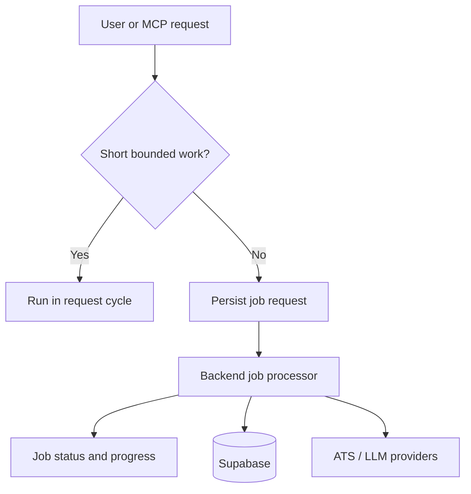

# Runtime And Observability

See also: [index.md](./index.md)

## Purpose

This document defines the runtime behavior, background processing approach, and operational visibility expectations for CeeVee.

## Runtime Model

The MVP uses:

- one frontend runtime
- one backend runtime
- one database platform

Inside the backend, work is divided into synchronous request flows and asynchronous job flows.
Long-running scraping and enrichment must rely on persisted job state rather than implicit in-memory request state alone.

## Sync Versus Async Policy

### Synchronous by default for:

- prompt submission
- company discovery requests
- direct opportunity viewing
- match-result retrieval for already-known data
- application logging

### Asynchronous by default for:

- broad scraping across many companies
- re-scraping stale career pages
- heavy enrichment or re-ranking passes
- retrospective insight refresh

### Hybrid rule

Small, bounded scraping tasks may start synchronously and continue asynchronously if runtime or provider limits are exceeded.
Bounded synchronous work should remain intentionally limited to avoid user-visible timeout behavior.

## Runtime Flow

Purpose:
This diagram explains how the architecture separates immediate request handling from longer-running jobs.

What the reader should understand:
The MVP does not assume everything is synchronous, even though it still runs inside one backend service boundary.

Why the diagram belongs here:
This file owns runtime behavior and operational flow.

## Reliability Expectations

The architecture should support:

- retryable external-provider calls where safe
- bounded retries with backoff for scraping adapters
- categorized failure recording
- resumable scraping flows
- stale-data detection for opportunities and career pages
- idempotent application logging where practical

## Observability Expectations

The backend should emit:

- structured logs for discovery, scraping, matching, and retrieval flows
- traceable job identifiers
- progress states for persisted jobs
- provider failure context without leaking sensitive document content
- metrics for scraping success rate, match latency, and retrieval usage

## Security And Privacy-Relevant Runtime Constraints

- Resume files and derived chunks are sensitive
- Application history is sensitive
- Logs must avoid dumping raw resume content or full generated prompts by default
- Provider-facing calls should be auditable at the event level
- backend and MCP entry points should attach work to an explicit user context

## Scaling Path

The first scaling step should be:

1. keep the web app unchanged
2. split job execution from request-serving if job volume grows
3. preserve the same domain and port interfaces

This keeps scale-related changes operational rather than architectural where possible.
