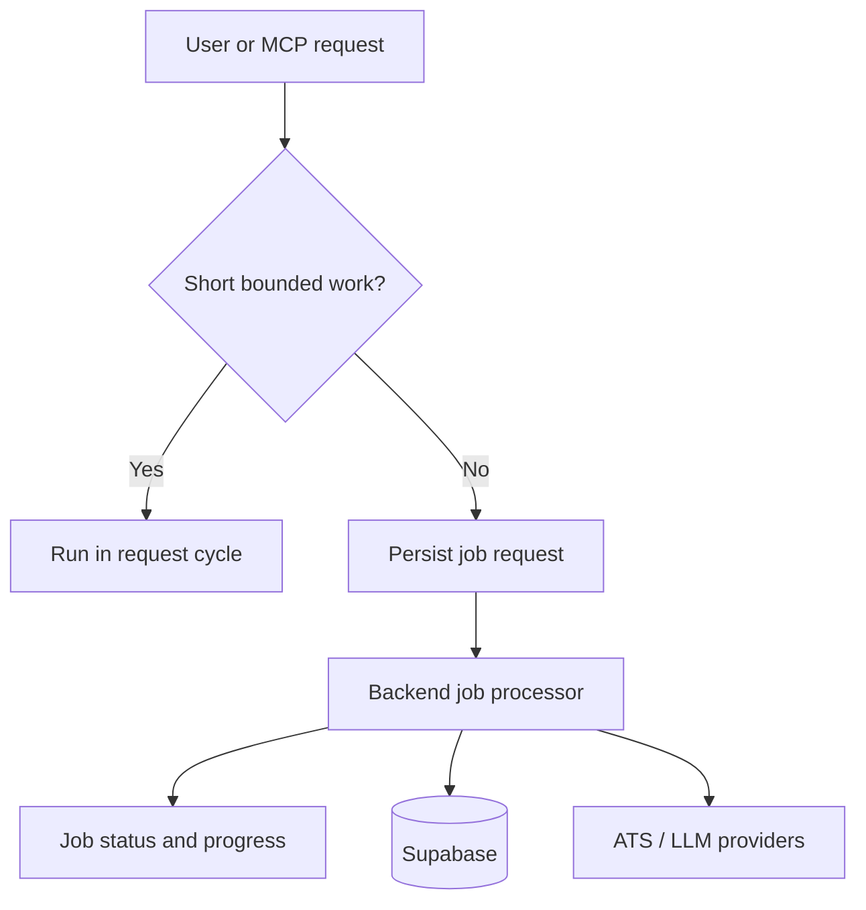

# Runtime And Observability

See also: [index.md](./index.md)

## Purpose

This document defines runtime semantics, trigger semantics, sync-vs-async rules, and observability requirements.

## Scope

This file owns:

- request-cycle semantics
- job-execution semantics
- learning-trigger semantics
- observability requirements

This file does not own:

- entity meaning
- module placement
- transport contract details

## Runtime Model

The MVP uses:

- one frontend runtime
- one backend runtime
- one database platform

Inside the backend, work is divided into synchronous request flows and asynchronous job flows.
Long-running scraping and enrichment must rely on persisted job state rather than implicit in-memory request state alone.

Runtime invariant:

- if work must survive request completion or retry safely, it must be represented as persisted job state

## Sync Versus Async Policy

### Synchronous by default for:

- prompt submission
- company discovery requests
- direct opportunity viewing
- match-result retrieval for already-known data
- application logging

### Asynchronous by default for:

- broad scraping across many companies
- re-scraping stale career pages
- heavy enrichment or re-ranking passes
- retrospective insight refresh

### Hybrid rule

Small, bounded scraping tasks may start synchronously and continue asynchronously if runtime or provider limits are exceeded.
Bounded synchronous work should remain intentionally limited to avoid user-visible timeout behavior.

Implementation rule:

- when in doubt, prefer explicit job state over hidden long request handling

## Insight Trigger Model

The learning and insight system should react to three different trigger classes.

### 1. Primary trigger: `Application` state change

The main trigger for insight generation is a change in application lifecycle state.

Typical examples include transitions such as:

- applied
- interview
- rejection
- no response

Architecturally, this is the strongest learning signal because it converts recommendation history into real outcome data.

### 2. Background trigger: retrospective insight refresh

The runtime should support retrospective reanalysis of historical application data.

This allows the system to:

- discover patterns that are only visible across larger history windows
- refresh older insights
- improve future recommendation quality without requiring a direct user-triggered recalculation every time

### 3. Retrieval trigger: new matching flow

When a new opportunity is evaluated, the runtime should retrieve relevant historical cases and existing insights as part of the matching flow.

This trigger does not always create a new `InsightRecord`.
Instead, it activates the use of accumulated learning inside the current `MatchResult`.

Trigger interpretation rule:

- application-state change creates or updates learning input
- retrospective refresh reprocesses accumulated history
- new matching consumes historical learning even when no new insight record is created

## Runtime Flow

Required interpretation:

- one backend runtime does not imply one execution mode
- job execution is part of the runtime model, not an implementation afterthought

## Reliability Expectations

The architecture should support:

- retryable external-provider calls where safe
- bounded retries with backoff for scraping adapters
- categorized failure recording
- resumable scraping flows
- stale-data detection for opportunities and career pages
- idempotent application logging where practical

Implementation rule:

- retries must be bounded and observable
- long-running work must be resumable or restartable without silent corruption

## Observability Expectations

The backend should emit:

- structured logs for discovery, scraping, matching, and retrieval flows
- traceable job identifiers
- progress states for persisted jobs
- provider failure context without leaking sensitive document content
- metrics for scraping success rate, match latency, and retrieval usage

For the learning system, observability should also make it possible to distinguish:

- whether an insight update was triggered by application-state change
- whether it was triggered by retrospective refresh
- whether historical retrieval influenced a current match operation

Implementation consequence:

- logs and metrics should let later agents explain why an insight or match changed

## Security And Privacy-Relevant Runtime Constraints

- Resume files and derived chunks are sensitive
- Application history is sensitive
- Logs must avoid dumping raw resume content or full generated prompts by default
- Provider-facing calls should be auditable at the event level
- backend and MCP entry points should attach work to an explicit user context

## Scaling Path

The first scaling step should be:

1. keep the web app unchanged
2. split job execution from request-serving if job volume grows
3. preserve the same domain and port interfaces

This keeps scale-related changes operational rather than architectural where possible.
