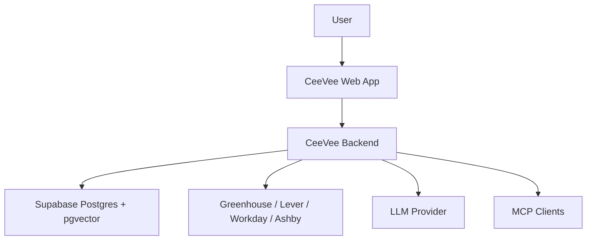

# System Context

See also: [index.md](./index.md)

## Purpose

This document defines the external actors, external dependencies, and high-level system flows around CeeVee.

## Scope

This file owns:

- who interacts with the system
- which external systems exist
- which high-level flows cross the system boundary

This file does not own:

- module placement
- entity lifecycle rules
- detailed interface contracts
- runtime trigger semantics

## Actors

- User
  Uploads resume versions, describes search intent, reviews opportunities, tracks applications, and reviews insights.

- CeeVee Web App
  The user-facing product surface for resume management, discovery, review, tracking, and insight presentation.

- CeeVee Backend
  Executes discovery, scraping, matching, retrieval, persistence, and MCP tool exposure.

- LLM Provider
  Supports company discovery, reasoning support, recommendation generation, and cover-letter scaffolding.

- Career Page / ATS Providers
  Source of job listings. Initial adapter family targets Greenhouse, Lever, Workday, and Ashby.

- Supabase
  Provides Postgres storage, vector storage through pgvector, object storage, and a future-compatible auth boundary.

- User Context Boundary
  Represents the identity and access scope attached to backend and MCP requests, even in the initial single-user MVP.

## External Dependency Rule

All non-trivial external integrations are backend-owned.

Implementation LLMs must not move these integrations into the frontend:

- ATS access
- LLM calls
- retrieval orchestration
- persistence orchestration
- MCP capability execution

## System Boundary

Required interpretation:

- the web app is inside the product boundary but not the owner of external integrations
- the backend is the integration authority
- Supabase is an external platform dependency, not domain logic

## Primary User Flows

### Resume and opportunity flow

1. User uploads one or more resume versions
2. User enters a natural-language job search prompt
3. Backend discovers candidate companies
4. Backend scrapes career pages and normalizes job listings
5. Backend scores jobs against one or more resume versions
6. Web app displays ranked opportunities with explanations and recommendations

### Application tracking flow

1. User marks a job as applied
2. User records outcomes over time
3. Backend stores application history
4. Retrieval uses that history for future scoring and insight generation

### User context flow

1. A web or MCP request enters the backend
2. The backend resolves a user context
3. Domain and application services execute within that context
4. Persistence and retrieval remain scoped to that context

### Skill and cover-letter assistance flow

1. User maintains a skill section and resume versions
2. Backend retrieves relevant resume chunks and opportunity context
3. Backend suggests relevant resume updates
4. Backend creates cover-letter scaffolding and learning backlog suggestions

## Flow Constraints

Implementation LLMs must preserve these high-level meanings:

- discovery flow must end in normalized opportunities, not raw ATS payloads
- application tracking flow must produce real historical records, not temporary UI state only
- user context must be resolved before scoped persistence or retrieval work
- skill and cover-letter support must consume resume and opportunity context through backend-owned logic

## Key Context Constraints

- The MVP is single-user by design
- The MVP still requires an explicit user context boundary at backend-facing interfaces
- The system does not auto-apply
- LinkedIn and Xing scraping are intentionally out of scope
- Scraping quality depends on external site structure and ATS behavior
- Retrieval quality depends on data preparation and stored history quality

## Context-Level Failure Risks

Implementation work must assume:

- ATS structures are unstable
- some scraping work cannot complete safely inside a request cycle
- unclear identity handling creates future interface breakage
- LLM-backed outputs require bounded domain interpretation
- resume and application data are sensitive
