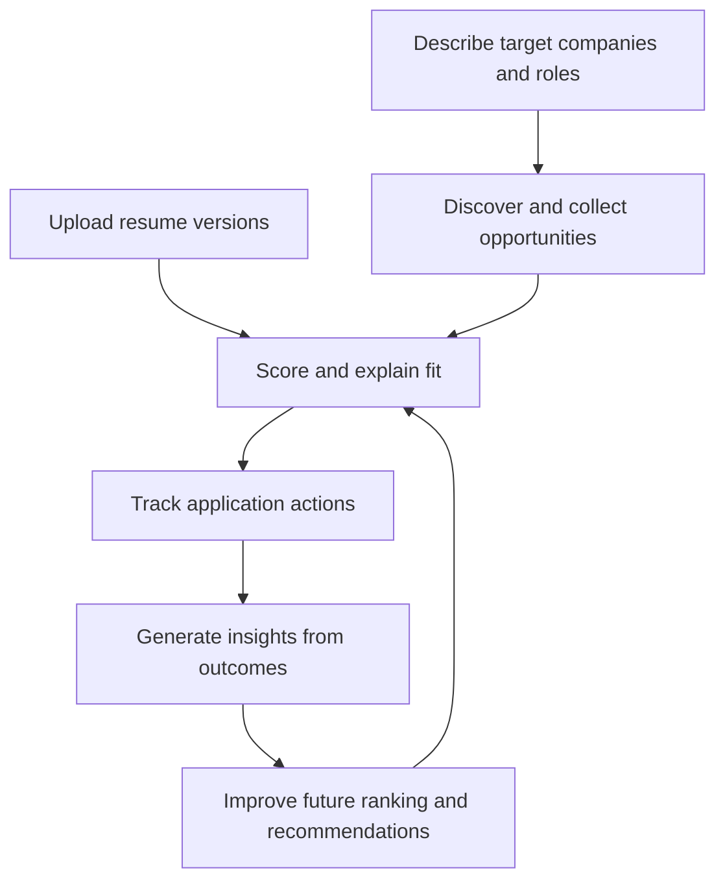

# User Perspective

See also: [index.md](./index.md)

## Purpose

This document defines user-visible product behavior and learning-loop meaning.

Primary use:

- tell implementation LLMs which system behavior must be visible to the user
- prevent internal architectural shortcuts that would break user-visible product semantics

## What The User Experiences

From the user perspective, CeeVee is not only a search tool.
It is a system that:

- stores and manages resume versions
- finds relevant companies and jobs
- compares opportunities against the user’s resume
- helps the user decide which resume to send
- tracks real application outcomes
- learns from those outcomes over time

Product rule:

- implementation work must preserve the learning-loop behavior visible here even if internal implementation changes

## Core User Journey

The visible product journey is:

1. the user uploads one or more resume versions
2. the user describes the kind of companies and jobs they want
3. CeeVee discovers companies and examines their career pages
4. CeeVee shows matching opportunities with explanations and recommendations
5. the user applies and records outcomes
6. CeeVee learns from that history and improves later suggestions

## User-Level System Flow

Required interpretation:

- recommendation quality must improve from user history over time
- application tracking is not optional reporting; it feeds later behavior

## Resume Management

The user can upload and retain multiple resume versions.

From the user perspective, this means:

- the system can compare different resume versions against the same opportunity
- recommendations are tied to a concrete version of the resume
- later application outcomes are linked to the version that was actually used

This is important because the system should not only know that the user applied.
It should also know which version of the resume was sent.

## Opportunity Discovery

The user does not need to search by rigid filters only.
Instead, the user can describe the target space in natural language.

From the user perspective, CeeVee translates that intent into:

- candidate companies
- relevant career pages
- normalized opportunities

This turns the product into more than a job board filter.
It acts as an opportunity discovery assistant.

## Matching And Recommendation

When the user sees an opportunity, the system does more than display a vacancy.

It produces a `MatchResult`, which answers questions such as:

- how well does this opportunity fit the selected resume?
- why does it fit?
- which resume version should be used?
- what should be emphasized or improved?

From the user perspective, this means the system does not only say “this job exists”.
It says “this is how and why this job fits you”.

Implementation consequence:

- a match result must carry explanation semantics, not score only

## Application Tracking

When the user decides to apply, the system creates an `Application` record.

This is important from the user perspective because it captures:

- that the user acted
- which opportunity they acted on
- which resume version they used
- what happened afterward

Statuses such as:

- applied
- interview
- rejection
- no response

turn the product from a search tool into a feedback-capturing system.

Implementation consequence:

- application tracking must persist actionable history, not ephemeral UI markers

## What `InsightRecord` Means From The User Perspective

`InsightRecord` represents a learned signal extracted from the user’s history.

In user terms, this means the system is able to detect patterns such as:

- “this profile performs well for a certain kind of role”
- “these companies or role shapes lead to better outcomes”
- “this missing skill appears repeatedly in unsuccessful applications”

An insight is therefore not raw history.
It is a system-level interpretation of history.

Do not infer:

- that `InsightRecord` replaces historical application data
- that raw history and interpreted signals are interchangeable

## How The Learning Mechanism Works

The learning process starts when the user updates real application outcomes.

### Step 1: history is created

Every change in application status becomes part of the user’s application history.

### Step 2: similar cases are retrieved

When the system evaluates a new opportunity, it can look for semantically similar past cases.

This uses retrieval over historical application material and related context.

### Step 3: patterns are extracted

The system compares:

- opportunities that led to positive results
- opportunities that led to rejection or weak outcomes
- the resume versions and skills involved in each case

### Step 4: an `InsightRecord` is formed

The system stores a learned signal about what appears to work, what appears to fail, and what should be improved.

## What Triggers Learning

From the user perspective, the learning system is not always running in the same way.
It is triggered by a small number of meaningful actions and system events.

### 1. Application status change

The primary learning trigger is a change to an `Application` record.

This happens when the user:

- marks an opportunity as applied
- records an interview
- records a rejection
- records another real outcome

From the user perspective, this is the most important learning signal because it turns recommendation history into real-world feedback.

### 2. Retrospective history refresh

The system may also improve its insights in the background by reanalyzing accumulated history.

From the user perspective, this means:

- the user does not need to trigger every insight manually
- patterns may become clearer over time as more history exists
- the system can discover trends that were not obvious from one event alone

### 3. Matching a new opportunity

When the user opens or evaluates a new opportunity, the system can use previously learned patterns immediately.

This does not necessarily create a brand-new insight every time.
Instead, it triggers the use of existing historical patterns during matching and recommendation.

## Event Chain From The User Perspective

One important user-visible learning chain is:

1. the user records a real application outcome
2. the application history becomes richer
3. the system updates or refines learned patterns
4. a future similar opportunity is evaluated using those patterns
5. the user receives a more informed ranking, recommendation, or skill-gap suggestion

This is how CeeVee turns user history into practical future guidance.

## Two-Layer Matching

From the user perspective, CeeVee should not rely on one layer of matching only.

### Layer 1: text and skill fit

This layer asks:

“How well do the resume content and the job description match?”

### Layer 2: historical fit

This layer asks:

“How similar is this opportunity to the types of opportunities where the user previously succeeded or failed?”

### Why this matters

This allows the system to distinguish between:

- formal textual fit
- likely practical success in the real market

As a result, an opportunity can be:

- textually strong but historically weak
- textually moderate but historically promising

This makes recommendations more realistic than pure text matching alone.

Implementation consequence:

- a matching implementation that ignores history is incomplete relative to the target architecture

## How Insights Change `MatchResult`

Without historical learning, a match score would only reflect present text comparison.

With insights, the system can refine the recommendation by considering past outcomes.

From the user perspective, this means:

- a strong textual match may be adjusted if similar past cases led to repeated rejection
- a recommendation may highlight a missing skill that repeatedly mattered before
- opportunities similar to successful past cases may rank higher

The architecture therefore uses history not only for reporting, but for improving future decision support.

## What The User Gets In Return

Over time, the user should receive:

- more accurate opportunity ranking
- stronger recommendations about which resume version to use
- a skill-gap backlog based on repeated patterns
- better explanation of why one opportunity is more promising than another

The system becomes more useful as the user records real outcomes.

## Why This Changes The Nature Of The Product

Without this feedback loop, CeeVee would be a search and matching tool.

With `Application`, retrieval over historical outcomes, and `InsightRecord`, CeeVee becomes a self-improving recommendation system.

Architecturally, this is one of the core product ideas:

- resume data represents potential
- opportunity data represents market targets
- application history represents reality
- insights bridge the gap between potential and reality

## Learning Loop Rule

The architecture should preserve one key principle from the user perspective:

the product must learn from real user outcomes without confusing:

- predicted fit
- actual action
- historical result
- generated interpretation

That distinction is what allows CeeVee to improve over time while remaining explainable.
