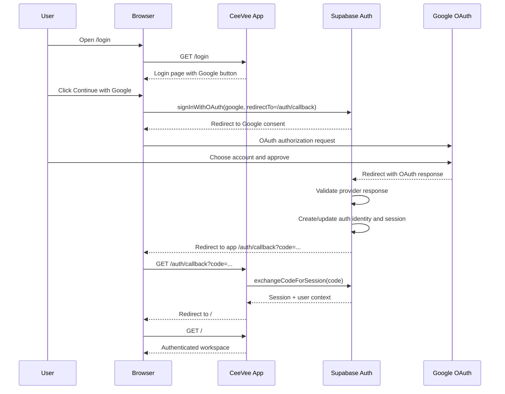
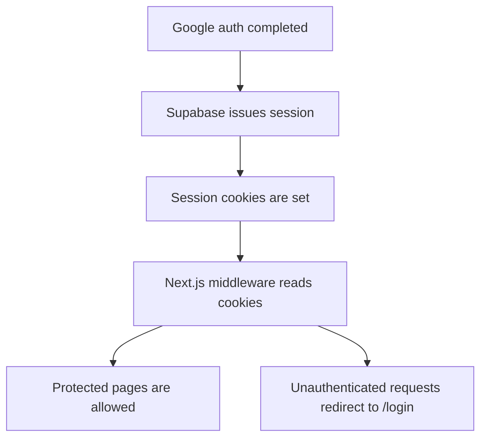

# Google Authentication

This document explains how Google authentication works in CeeVee, how it is configured, how it interacts with Supabase, where related data is stored, and how to operate it safely in local development and deployed environments.

## Purpose

CeeVee uses Google OAuth for sign-in.

The app itself does not talk to Google directly for the final session exchange. Instead:

1. the browser starts Google sign-in through Supabase Auth
2. Google redirects back to Supabase Auth
3. Supabase validates the OAuth response and creates the authenticated session
4. Supabase redirects the browser back to the app
5. the app reads the Supabase session and shows authenticated UI

This architecture keeps the OAuth exchange centralized in Supabase and allows the app to rely on Supabase SSR session handling instead of implementing a custom Google token flow.

## High-Level Flow

```mermaid
flowchart LR
    A["User opens /login"] --> B["User clicks Continue with Google"]
    B --> C["Browser calls Supabase Auth signInWithOAuth(provider=google)"]
    C --> D["Supabase Auth redirects browser to Google OAuth"]
    D --> E["User selects Google account and grants consent"]
    E --> F["Google redirects to Supabase callback<br/>http://127.0.0.1:54321/auth/v1/callback"]
    F --> G["Supabase Auth validates OAuth response<br/>and creates/updates session"]
    G --> H["Supabase redirects browser to app callback<br/>/auth/callback?code=..."]
    H --> I["App server exchanges code for session via Supabase SSR"]
    I --> J["Browser is redirected to /"]
    J --> K["Authenticated UI loads"]
```



## Why Supabase Sits in the Middle

Supabase is the identity broker for the app.

That means:

- Google is the external identity provider
- Supabase Auth is the authentication system used by the app
- the Next.js app trusts Supabase sessions, not raw Google OAuth responses

This gives us:

- one authentication surface for all providers
- one session model for browser and server code
- one place for user creation and identity linking
- SSR-compatible cookies and middleware integration

## End-to-End Sequence



## Project Components

The Google auth flow in this repo currently relies on these pieces:

- [`apps/web/src/modules/auth/components/login-form.tsx`](/Users/anastasiakiessig/webeet/application-agent/apps/web/src/modules/auth/components/login-form.tsx)
  Starts Google sign-in with `supabase.auth.signInWithOAuth({ provider: 'google' })`
- [`apps/web/src/app/auth/callback/route.ts`](/Users/anastasiakiessig/webeet/application-agent/apps/web/src/app/auth/callback/route.ts)
  Completes the PKCE callback on the server
- [`apps/web/src/lib/supabase/client.ts`](/Users/anastasiakiessig/webeet/application-agent/apps/web/src/lib/supabase/client.ts)
  Browser Supabase client
- [`apps/web/src/lib/supabase/server.ts`](/Users/anastasiakiessig/webeet/application-agent/apps/web/src/lib/supabase/server.ts)
  Server Supabase client
- [`apps/web/src/lib/supabase/middleware.ts`](/Users/anastasiakiessig/webeet/application-agent/apps/web/src/lib/supabase/middleware.ts)
  Session refresh and cookie propagation
- [`apps/web/src/middleware.ts`](/Users/anastasiakiessig/webeet/application-agent/apps/web/src/middleware.ts)
  Route protection logic
- [`supabase/config.toml`](/Users/anastasiakiessig/webeet/application-agent/supabase/config.toml)
  Local Supabase Auth provider configuration

## Google Cloud Console Setup

### What to Create

In Google Cloud Console:

1. Open the Google Cloud project you want to use for CeeVee
2. Open `Google Auth Platform`
3. Open `Branding`
4. Set the app name users should see during sign-in, for example `CeeVee`
5. Open `Clients`
6. Create a new OAuth client
7. Choose `Web application`

### Required Client Settings

Use these values for local development:

- Authorized JavaScript origin:
  `http://localhost:3000`
- Authorized redirect URI:
  `http://127.0.0.1:54321/auth/v1/callback`

### What `54321` Actually Is

`54321` is the local Supabase API/Auth port exposed by the Supabase CLI development stack.

It is not a Google-specific port and it is not an AWS endpoint.

In local development, Supabase runs multiple services on fixed local ports. In this project:

- `http://127.0.0.1:54321` is the local Supabase API/Auth entrypoint
- `http://127.0.0.1:54323` is Supabase Studio
- `http://127.0.0.1:54324` is the local email testing UI

That is why Google must redirect to:

- `http://127.0.0.1:54321/auth/v1/callback`

Google returns the user to Supabase first, not directly to Next.js.

### Important Note About the App Name

The app name shown on the Google consent screen comes from the Google project's branding / consent screen configuration, not from the env variable names and not from the Supabase config.

If Google still shows an old name such as a previous project name, check the `Branding` page in Google Cloud Console.

## Local Environment Configuration

### Values Stored in `.env.local`

For local development, the app uses a root `.env.local` file:

- [`.env.local`](/Users/anastasiakiessig/webeet/application-agent/.env.local)

The Google OAuth values that must be present are:

```env
SUPABASE_AUTH_EXTERNAL_GOOGLE_CLIENT_ID=your-google-client-id
SUPABASE_AUTH_EXTERNAL_GOOGLE_CLIENT_SECRET=your-google-client-secret
```

Other related local values commonly present in `.env.local`:

```env
NEXT_PUBLIC_SUPABASE_URL=http://127.0.0.1:54321
NEXT_PUBLIC_SUPABASE_ANON_KEY=...
SUPABASE_SERVICE_ROLE_KEY=...
NEXT_PUBLIC_APP_URL=http://localhost:3000
```

### Example File

The shared template is:

- [`.env.example`](/Users/anastasiakiessig/webeet/application-agent/.env.example)

That file is committed so other developers can see which variables are required.

## Supabase Configuration

The local provider configuration lives in:

- [`supabase/config.toml`](/Users/anastasiakiessig/webeet/application-agent/supabase/config.toml)

The Google section is:

```toml
[auth.external.google]
enabled = true
client_id = "env(SUPABASE_AUTH_EXTERNAL_GOOGLE_CLIENT_ID)"
secret = "env(SUPABASE_AUTH_EXTERNAL_GOOGLE_CLIENT_SECRET)"
redirect_uri = ""
url = ""
skip_nonce_check = false
email_optional = false
```

### Why `client_id` and `secret` Are Referenced Through `env(...)`

This keeps secrets out of committed config files.

The `config.toml` file declares which environment variables Supabase Auth should read, while the actual secret values live in the developer's `.env.local` or in the deployment platform's environment settings.

## Why the Redirect Goes Through Supabase

The Google redirect URI points to:

`http://127.0.0.1:54321/auth/v1/callback`

That is the Supabase Auth callback endpoint, not the Next.js app directly.

This is intentional.

Google must return to Supabase first because Supabase is responsible for:

- validating the provider response
- creating or updating the auth identity
- issuing the application session
- handing the browser back to the app

After Supabase completes that work, it redirects the browser to the app callback:

- `<current-app-origin>/auth/callback`

In short:

- Google -> Supabase on `127.0.0.1:54321`
- Supabase -> CeeVee on the same app origin that initiated the sign-in flow

## App Callback Behavior

The app callback route lives here:

- [`apps/web/src/app/auth/callback/route.ts`](/Users/anastasiakiessig/webeet/application-agent/apps/web/src/app/auth/callback/route.ts)

It performs the server-side exchange:

1. read `code` from the callback URL
2. call `supabase.auth.exchangeCodeForSession(code)`
3. set the authenticated session
4. redirect the user to `/`

This route is server-side on purpose.

For Google OAuth with Supabase PKCE, the code verifier must be available in SSR-compatible session storage. A client-only callback can fail with errors such as:

`PKCE code verifier not found in storage`

That is why this project uses a route handler instead of a client callback page for the final exchange.

## Session and Cookies

The browser and server share the authenticated state through Supabase-managed cookies.



Relevant files:

- [`apps/web/src/lib/supabase/middleware.ts`](/Users/anastasiakiessig/webeet/application-agent/apps/web/src/lib/supabase/middleware.ts)
- [`apps/web/src/middleware.ts`](/Users/anastasiakiessig/webeet/application-agent/apps/web/src/middleware.ts)

## What Is Stored in the Database

Supabase stores authenticated users in the `auth.users` table.

For Google-authenticated users, useful fields commonly include:

- `email`
- `raw_user_meta_data`
- `raw_app_meta_data`

Typical Google profile attributes stored in `raw_user_meta_data`:

- `email`
- `name`
- `full_name`
- `picture`
- `avatar_url`
- `sub`
- `provider_id`

Typical provider metadata stored in `raw_app_meta_data`:

- `provider`
- `providers`

Example conceptual shape:

```json
{
  "email": "user@example.com",
  "raw_app_meta_data": {
    "provider": "google",
    "providers": ["google"]
  },
  "raw_user_meta_data": {
    "email": "user@example.com",
    "name": "User Name",
    "full_name": "User Name",
    "picture": "https://lh3.googleusercontent.com/...",
    "avatar_url": "https://lh3.googleusercontent.com/..."
  }
}
```

### What Is Not Stored in the Database

The Google OAuth client secret is not stored in `auth.users` and should not be stored in application tables.

It belongs in environment configuration only.

## Where the Avatar Comes From

The UI avatar shown after login is derived from Google profile data that Supabase stores in the user metadata.

Relevant UI files:

- [`apps/web/src/app/page.tsx`](/Users/anastasiakiessig/webeet/application-agent/apps/web/src/app/page.tsx)
- [`apps/web/src/modules/auth/components/user-badge.tsx`](/Users/anastasiakiessig/webeet/application-agent/apps/web/src/modules/auth/components/user-badge.tsx)

The UI tries multiple fields to be resilient:

- `user_metadata.avatar_url`
- `user_metadata.picture`
- identity-level `avatar_url`
- identity-level `picture`

If none of those exist, it falls back to an initial-based placeholder.

## Local Restart Rules

When Google OAuth configuration changes, the correct restart behavior matters.

### If You Change `.env.local`

Examples:

- `SUPABASE_AUTH_EXTERNAL_GOOGLE_CLIENT_ID`
- `SUPABASE_AUTH_EXTERNAL_GOOGLE_CLIENT_SECRET`

Then restart the local stack:

```bash
supabase stop --no-backup
pnpm dev:stack
```

Reason:

- Supabase Auth reads those values at startup
- restarting only the browser or only Next.js is not enough

### If You Change Only Frontend Rendering Code

Examples:

- login page UI
- avatar display
- header styling

Usually restarting `Next.js` is enough, and in many cases hot reload already covers it.

### If You Change the Google Client ID or Secret

This project does not need a large key-rotation process document for Google sign-in alone.

Operationally, the rule is simple:

1. update the values in `.env.local` or in the deployment environment
2. restart Supabase Auth or restart the deployment environment

Changing the Google OAuth client credentials does not by itself require a database migration.

Existing users remain in `auth.users`. Future sign-ins simply use the new Google OAuth client configuration.

## Local vs Hosted Environments

### Local

- Google OAuth credentials live in `.env.local`
- Supabase runs via Docker
- redirect URI points to local Supabase on `127.0.0.1:54321`

### Hosted / Preview / Production

- Google OAuth credentials should live in the hosting platform's secret manager or env settings
- do not commit real secrets to the repository
- the redirect URI must match the hosted Supabase or hosted auth callback setup for that environment

If the project is deployed through a platform such as Vercel, the Google client ID and secret should be stored in that platform's environment variable settings, not in committed files.

## Troubleshooting

### Error: `redirect_uri_mismatch`

Google does not recognize the callback URI as one of the allowed redirect URIs.

Check:

- Google OAuth client type is `Web application`
- Authorized redirect URI is exactly:
  `http://127.0.0.1:54321/auth/v1/callback`
- no extra slash at the end
- no `https` if you are using the local HTTP flow

### Error: Old App Name Still Appears

Google is showing the app name from the OAuth consent screen / branding page.

Check:

- `Google Auth Platform` -> `Branding`
- the correct Google Cloud project is open
- the app name is updated there

### Error: `PKCE code verifier not found in storage`

This usually means the callback exchange is being attempted in the wrong place, or the flow was started and completed in different browser contexts.

In this project, the callback exchange must remain server-side in:

- [`apps/web/src/app/auth/callback/route.ts`](/Users/anastasiakiessig/webeet/application-agent/apps/web/src/app/auth/callback/route.ts)

### Google Login Opens but Wrong Accounts Work

This often points to Google-side configuration, not app code.

Check:

- whether the OAuth consent screen is still in testing mode
- whether only specific test users are allowed
- whether the active Google Cloud project is the correct one

## Verification Checklist

Use this checklist when validating a new setup:

1. Google Cloud project branding shows `CeeVee`
2. OAuth client type is `Web application`
3. JavaScript origin is `http://localhost:3000`
4. Redirect URI is `http://127.0.0.1:54321/auth/v1/callback`
5. `.env.local` contains the Google client ID and secret
6. Supabase was restarted after changing env values
7. `/login` shows `Continue with Google`
8. login redirects through Google and returns to `/`
9. the authenticated header shows the correct email/name
10. the Google avatar is visible in the UI

## Related Files

- [README.md](/Users/anastasiakiessig/webeet/application-agent/README.md)
- [docs/local-database.md](/Users/anastasiakiessig/webeet/application-agent/docs/local-database.md)
- [supabase/config.toml](/Users/anastasiakiessig/webeet/application-agent/supabase/config.toml)
- [apps/web/src/app/auth/callback/route.ts](/Users/anastasiakiessig/webeet/application-agent/apps/web/src/app/auth/callback/route.ts)
- [apps/web/src/modules/auth/components/login-form.tsx](/Users/anastasiakiessig/webeet/application-agent/apps/web/src/modules/auth/components/login-form.tsx)
- [apps/web/src/modules/auth/components/user-badge.tsx](/Users/anastasiakiessig/webeet/application-agent/apps/web/src/modules/auth/components/user-badge.tsx)
